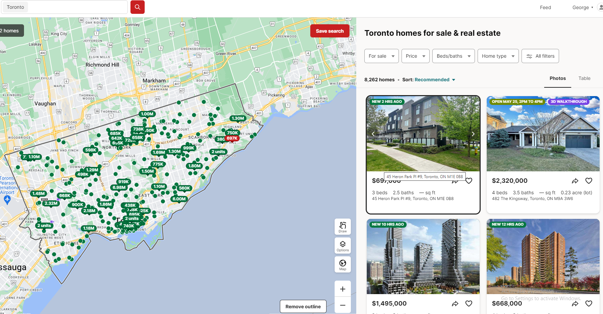

# Rental Properties SaaS Platform

## Introduction

Welcome to the Rental Properties SaaS Platform, a powerful tool designed to simplify the process of searching for and managing rental properties across Canada. Our platform provides property managers, landlords, and investors with essential features and data-driven insights to optimize their rental property management and investment strategies.

## Key Features

### Advanced Search Filters
Customize your property search with filters for location, rent range, property type, and more.

### Comprehensive Listings
Access detailed property information including photos, descriptions, and rental history.

### Rental Yield Calculator
Calculate potential rental yields with our integrated calculator.

### Interactive Maps
Visualize properties on interactive maps with neighborhood data and amenities.

### Property Management Tools
Manage your rental properties efficiently with features for tracking leases, tenants, and maintenance requests.

### User-Friendly Interface
Enjoy a seamless and intuitive user experience designed for both novice and experienced property managers and investors.

## Getting Started

1. **Sign Up:** Create an account to start exploring rental properties and managing your portfolio.
2. **Search Properties:** Use our advanced filters to find rental properties that meet your criteria.
3. **Analyze Data:** Utilize our market analytics and rental yield calculator to evaluate potential investments.
4. **Manage Properties:** Use our property management tools to keep track of leases, tenants, and maintenance.
5. **Make Informed Decisions:** Leverage our detailed insights to make well-informed rental property management and investment decisions.

## Conclusion

The Rental Properties SaaS Platform is your comprehensive solution for effective rental property management and investment in Canada. We are committed to helping you find and manage the best rental properties with ease and confidence.